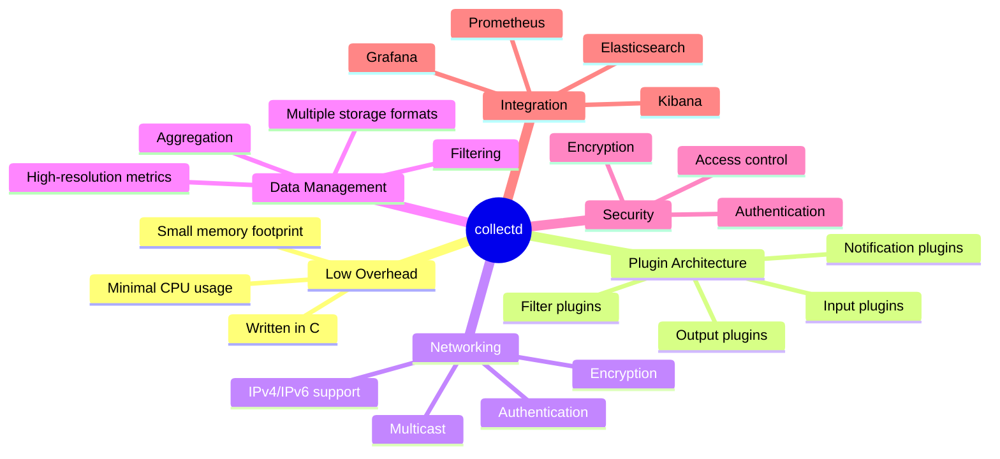
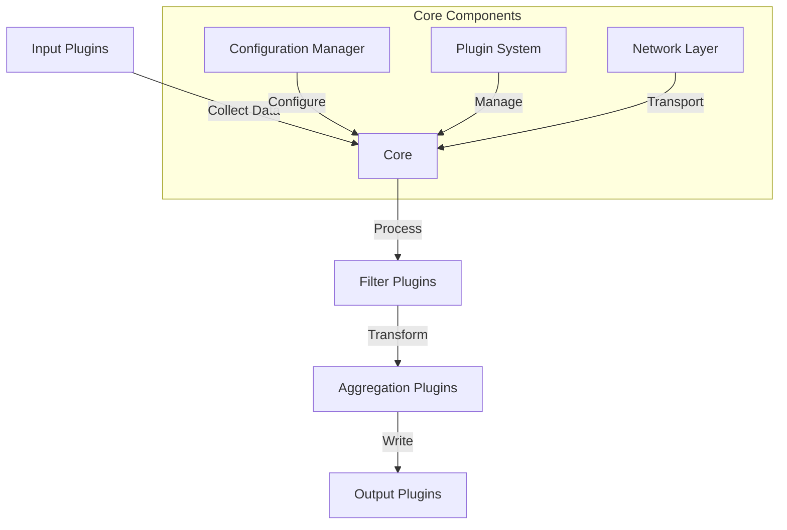
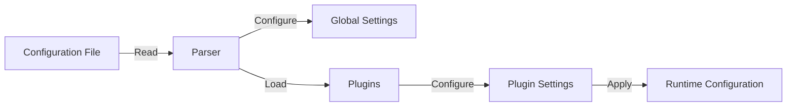
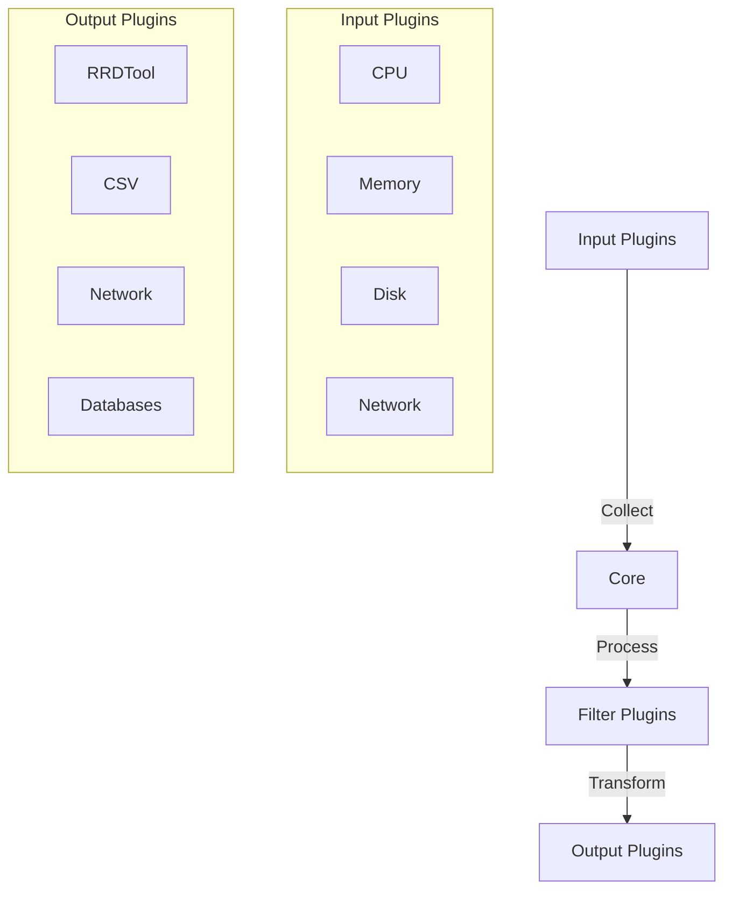
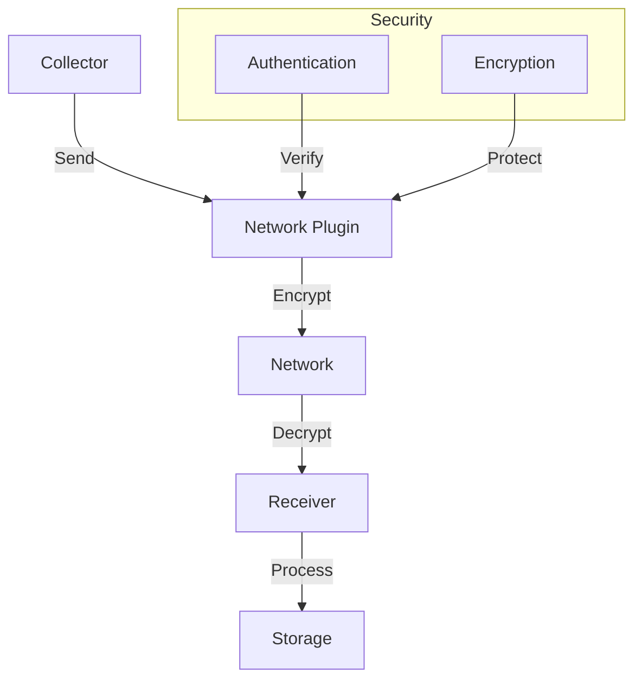
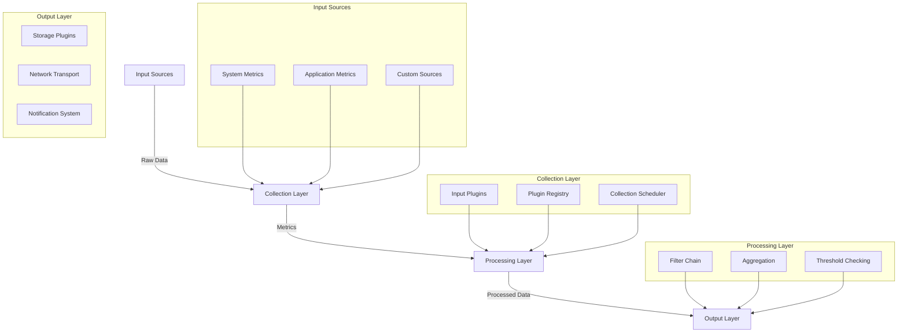

# collectd - The system statistics collection daemon

Collectd is an open-source system statistics collection daemon, designed to provide real-time insights into system performance and application behavior. With its modular architecture and lightweight design, collectd excels in collecting, processing, and transmitting data, making it ideal for monitoring infrastructure ranging from individual devices to large-scale environments. It supports a wide range of data sources, flexible storage backends, and secure networking, offering a comprehensive solution for both real-time monitoring and historical data analysis.

## Table of Contents

- [Features](#features)
- [Architecture](#architecture)
- [Installation](#installation)
- [Configuration](#configuration)
- [Usage](#usage)
- [Plugin System](#plugin-system)
- [Data Storage](#data-storage)
- [Networking](#networking)
- [Security](#security)
- [Integration](#integration)
- [FAQ](#frequently-asked-questions)
- [Quick Start Guide](#quick-start-guide)
- [Best Practices](#best-practices)

---

## Features



### Key Features:

- **Low overhead**: Written in C for maximum performance and minimal system impact
- **Extensible plugin architecture**: Easy to add new data sources and output methods
- **Networking support**: Ability to send and receive data over the network
- **High-resolution metrics**: Sub-second resolution for collected data
- **Powerful filtering and aggregation**: Process data before storage or transmission
- **Wide range of data sources**: From basic system metrics to application-specific data
- **Multiple output formats**: Store data in various formats including RRD, CSV, and more
- **Authentication and encryption**: Secure network communications
- **Threshold monitoring and notification**: Alert on specific conditions

## Architecture



### Core Components

1. **Core Engine**: Manages the overall process and plugin lifecycle
2. **Configuration Manager**: Handles configuration parsing and validation
3. **Plugin System**: Provides plugin API and management
4. **Network Layer**: Handles data transmission and reception
5. **Value Handler**: Processes and transforms collected data

## Installation

### Prerequisites

- C compiler (C99 compatible)
- Make
- libtool
- pkg-config
- POSIX threads (pthread) library

### Building from Source

```bash
git clone https://github.com/collectd/collectd.git
cd collectd
./build.sh
./configure
make
sudo make install
```

### Package Managers

```bash
# Debian/Ubuntu
apt-get install collectd

# RHEL/CentOS
yum install collectd

# macOS (Homebrew)
brew install collectd
```

## Configuration



### Basic Configuration Example

```apache
# Global settings
Hostname "myhost"
Interval 10

# Load plugins
LoadPlugin cpu
LoadPlugin memory

# Plugin configuration
<Plugin disk>
  Disk "/dev/sda"
  IgnoreSelected false
</Plugin>
```

### Important Settings

- `Hostname`: Sets the hostname for collected data
- `Interval`: Default interval between data collections (in seconds)
- `ReadThreads`: Number of threads used for data collection
- `WriteThreads`: Number of threads used for data dispatch

## Usage

### Starting collectd

```bash
# Start as daemon
collectd

# Run in foreground
collectd -f

# Test configuration
collectd -t

# Use alternate config file
collectd -C /path/to/config
```

### Signals

- `SIGINT`, `SIGTERM`: Graceful shutdown
- `SIGHUP`: Restart daemon
- `SIGUSR1`: Flush all plugins

## Plugin System



### Input Plugins

- **System Metrics**
  - cpu: CPU usage statistics
  - memory: Memory usage statistics
  - disk: Disk usage and I/O statistics
  - interface: Network interface statistics
  - load: System load statistics

- **Application Metrics**
  - apache: Apache web server statistics
  - mysql: MySQL database statistics
  - nginx: Nginx web server statistics
  - postgresql: PostgreSQL database statistics
  - java: JVM statistics via JMX

### Output Plugins

- **File-based Storage**
  - csv: Write to CSV files
  - rrdtool: Write to RRD files

- **Network and Databases**
  - network: Send data over the network
  - write_graphite: Send to Graphite
  - write_prometheus: Expose for Prometheus
  - write_influxdb: Send to InfluxDB

## Data Storage

### RRD Storage

```apache
LoadPlugin rrdtool
<Plugin rrdtool>
  DataDir "/var/lib/collectd/rrd"
  CacheFlush 120
  WritesPerSecond 50
</Plugin>
```

### CSV Storage

```apache
LoadPlugin csv
<Plugin csv>
  DataDir "/var/lib/collectd/csv"
  StoreRates false
</Plugin>
```

## Networking



### Network Configuration

```apache
LoadPlugin network
<Plugin network>
  <Server "192.168.1.101" "25826">
    SecurityLevel Encrypt
    Username "user"
    Password "secret"
  </Server>
</Plugin>
```

## Security

### Security Features

- Authentication with username/password
- Network traffic encryption
- Access control lists
- Plugin-specific security options

## Integration

### Supported Integrations

- **Visualization**
  - Grafana
  - Kibana
  - Custom dashboards

- **Storage Systems**
  - Prometheus
  - InfluxDB
  - Elasticsearch
  - OpenTSDB

- **Processing Systems**
  - Apache Kafka
  - RabbitMQ
  - Redis

### Detailed Feature Breakdown

#### Performance Metrics Collection
- **System-level Metrics**
  - CPU utilization per state (user, system, idle, etc.)
  - Memory usage (free, used, buffered, cached)
  - Disk I/O statistics (reads, writes, latency)
  - Network interface throughput and errors
  - Process statistics (CPU usage, memory usage, file descriptors)
  - System load averages
  - Temperature sensors
  - Battery status

- **Application-level Metrics**
  - Database performance metrics (MySQL, PostgreSQL, MongoDB)
  - Web server statistics (Apache, Nginx)
  - Java application metrics through JMX
  - Container metrics (Docker, LXC)
  - Virtual machine statistics (libvirt)
  - Message queue metrics (RabbitMQ, Apache Kafka)
  - Cache server statistics (memcached, Redis)

#### Advanced Data Processing
- **Filtering Capabilities**
  - Regular expression matching
  - Threshold-based filtering
  - Rate calculations
  - Value aggregation
  - Statistical analysis

- **Notification System**
  - Threshold-based alerts
  - Trend analysis
  - Custom notification scripts
  - Integration with monitoring systems
  - Email notifications
  - SNMP traps

[Previous Architecture section with added detail:]

### Detailed Architecture Overview



#### Component Details

1. **Collection Layer**
   - Plugin Registry manages plugin lifecycle
   - Collection Scheduler handles timing and coordination
   - Input plugins operate independently and concurrently

2. **Processing Layer**
   - Filter Chain processes raw metrics
   - Aggregation combines related metrics
   - Threshold Checking monitors for alert conditions

3. **Output Layer**
   - Storage Plugins write to various backends
   - Network Transport handles data transmission
   - Notification System manages alerts

[Previous sections continue, then add new FAQ section:]

## Frequently Asked Questions

### General Questions

* **Q**: What platforms does collectd support?  
  **A**: collectd is cross-platform, supporting various Unix-like systems, including:
  - Linux (all major distributions)
  - FreeBSD
  - macOS
  - OpenBSD
  - Solaris
  - AIX

* **Q**: Can I run collectd on a low-resource system?  
  **A**: Yes, collectd is designed to have a minimal footprint. Key characteristics:
  - Typical memory usage: 2-10MB RAM
  - CPU usage: Usually less than 1%
  - Disk space: 5-20MB depending on plugins
  - Configurable resource limits

* **Q**: What's the recommended polling interval?  
  **A**: The default 10-second interval works well for most cases. However:
  - For detailed monitoring: 1-5 seconds
  - For basic monitoring: 30-60 seconds
  - For resource-constrained systems: 60+ seconds
  Note: Different plugins can use different intervals.

* **Q**: How does collectd handle network interruptions?  
  **A**: collectd implements several strategies:
  - Local data caching
  - Automatic reconnection
  - Queue management
  - Persistence of unsent data

* **Q**: Can collectd aggregate data from multiple sources?  
  **A**: Yes, through various methods:
  - Network plugin for direct collection
  - Write plugins for central databases
  - Built-in aggregation features
  - Custom aggregation plugins

### Performance & Scalability

* **Q**: How many metrics can collectd handle?  
  **A**: Depends on hardware and configuration, but typical scenarios:
  - Single server: 10,000+ metrics/second
  - Clustered setup: 100,000+ metrics/second
  - Limited mainly by storage backend

## Quick Start Guide

Get collectd up and running quickly with these steps:

1. **Installation**
   ```bash
   # Ubuntu/Debian
   sudo apt-get update
   sudo apt-get install collectd collectd-utils
   ```

2. **Basic Configuration**
   ```apache
   # /etc/collectd/collectd.conf
   Hostname "myserver"
   Interval 10

   LoadPlugin cpu
   LoadPlugin memory
   LoadPlugin disk
   LoadPlugin interface

   <Plugin disk>
     Disk "/dev/sda"
     IgnoreSelected false
   </Plugin>
   ```

3. **Start Service**
   ```bash
   sudo systemctl start collectd
   sudo systemctl enable collectd
   ```

4. **Verify Operation**
   ```bash
   collectdctl listval
   ```

## Best Practices

### Configuration Guidelines

1. **Resource Management**
   - Start with essential plugins
   - Monitor collectd's own resource usage
   - Use appropriate intervals
   - Implement data filtering

2. **Security**
   - Use encryption for network traffic
   - Implement authentication
   - Regular security updates
   - Monitor log files

3. **Scaling**
   - Hierarchical collection
   - Load balancing
   - Data aggregation
   - Storage optimization

## Getting Help

### Support Channels

1. **Community Support**
   - GitHub Issues: Technical problems and feature requests
   - Mailing List: General discussion and announcements
   - IRC: Real-time chat with community
   - Stack Overflow: Q&A with 'collectd' tag

2. **Commercial Support**
   - Various companies offer commercial support
   - Professional services available
   - Custom development
   - Training and consultation

[Back to top](#collectd---the-system-statistics-collection-daemon)
