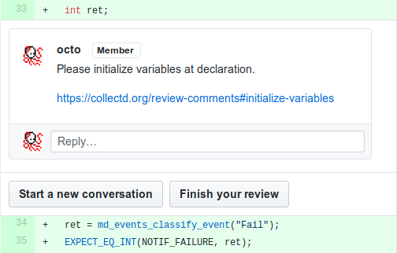

# Code Review Comments

This is a collection of frequent code review comments, collected here for
reference and discussed in more depth than a typical code review would allow.

The intended use for this document is to point to it from a code review to make
a point quickly while still providing the contributor with enough information
to resolve the issue. For example, a good review comment would be:



A link to each paragraph is provided at the beginning for easy copy'n'pasting.

## Initialize variables

→ [https://collectd.org/review-comments#initialize-variables](https://collectd.org/review-comments#initialize-variables)

Initialize variables when declaring them. By default, C does not initialize
local variables when they are defined. If a code path ends up reading the
variable before it is initialized, for example because a loop body is never
executed, it will read random data, causing undefined behavior. Worst case,
pointers will point to random memory causing a segmentation fault.

**Examples:**

```c
/* Initialize scalar with to literal: */
int status = 0;

/* Initialize pointer with function call: */
char *buffer = calloc(1, buffer_size);

/* Initialize struct with struct initializer: */
struct addrinfo ai = {
  .ai_family = AF_UNSPEC,
  .ai_flags = AI_ADDRCONFIG,
  .ai_socktype = SOCK_STREAM,
};

/* Initialize struct with zero: */
struct stat statbuf = {0};
```

In the last example, `{0}` is the universal struct initializer that, in theory,
should be able to zero-initialize any struct. In practise, however, some
compilers don't implement this correctly and will get confused when the first
member is a struct or a union. Our *continuous integration* framework will
catch these cases.

## Define variables on first use

→ [https://collectd.org/review-comments#define-variables-on-first-use](https://collectd.org/review-comments#define-variables-on-first-use)

Local variables should be defined when they are first used, ideally when they
can be initialized. For example:

```c
struct foo *f = calloc(1, sizeof(*f));
if (f == NULL) {
  return ENOMEM;
}

/* GOOD: status defiened and initialized late. */
int status = function_call(f);
```

Sometimes variables are initialized by passing a pointer to them to a function.
In that case define them as close to the function call as you can and
zero-initialize them. The function may only partially initialize a struct or
not initialize a struct at all in some circumstances.

**Example:**

```c
char const *path = determine_path();

struct stat s = {0};
int status = stat(path, &s);
```

Old C standards (C89 and ealier) required variables to be defined at the
beginning of a scope block. The following *bad* style is still frequently
found:

```c
/* BAD: local variables defined at beginning of block. */
struct foo *f;
int status;

f = calloc(1, sizeof(*f));
if (f == NULL) {
  return ENOMEM;
}

status = function_call(f);
```
